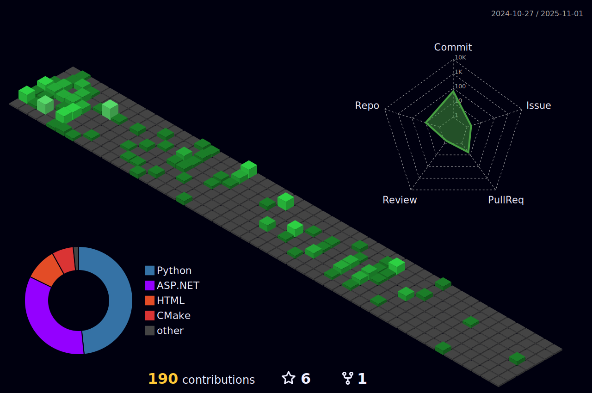

<h2 align="legft">Hi 👋, I'm Lorenzo</h1>
<h4 align="left">I'm a Master Degree Student in Artificial Intelligence at University of Verona, passionate about reinforcement learning and artificial intelligence and particularly to its application into the real world</h3>

<h2 align="left">Languages and Tools:</h3>

       

## 🌱 I’m currently learning:
- Julia
- Montecarlo Tree Search Algorithms applied to Partially Observable Enviroments

## 👯 Part of
- [Kodikas Group](https://github.com/kodikasgroup)

## 📰 Blogs posts
<!-- BLOG-POST-LIST:START -->
- [Q-Learning Easily Explained](https://medium.com/@lorenzobonanni/q-learning-easily-explained-1eb3d1491cef?source=rss-68419ad6fa9e------2)
- [An Introduction to Markov Decision Processes](https://medium.com/@lorenzobonanni/an-introduction-to-markov-decision-processes-835abc4dea56?source=rss-68419ad6fa9e------2)
<!-- BLOG-POST-LIST:END -->

## 📝 Contact Me

 

## 📊 Stats
Here's some stats about my work!

 

